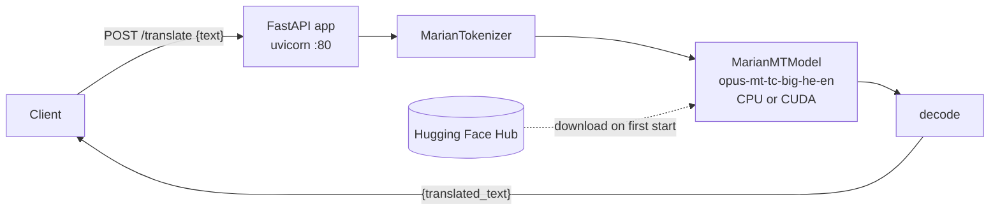

# translator

A small self-hosted REST service that translates **Hebrew text into English**. It wraps the
pretrained [`Helsinki-NLP/opus-mt-tc-big-he-en`](https://huggingface.co/Helsinki-NLP/opus-mt-tc-big-he-en)
MarianMT model (Hugging Face Transformers + PyTorch) in a single FastAPI endpoint, so other
tools (scripts, n8n workflows, bots, home-automation) can get a translation with one HTTP call.
Translation runs locally: no external translation API and no API key are involved.

## Table of contents

- [Features](#features)
- [How it works](#how-it-works)
- [Requirements](#requirements)
- [Installation](#installation)
- [Configuration](#configuration)
- [API reference](#api-reference)
- [Troubleshooting](#troubleshooting)
- [Security notes](#security-notes)
- [Development](#development)
- [Contributing](#contributing)
- [License](#license)

## Features

- One endpoint, `POST /translate`: send Hebrew text as JSON, get English text back.
- Local inference with the MarianMT model `Helsinki-NLP/opus-mt-tc-big-he-en`; nothing is sent
  to a third-party translation service.
- Uses an NVIDIA GPU automatically when PyTorch can see one (CUDA), otherwise runs on CPU.
- Interactive API docs generated by FastAPI (`/docs`, `/redoc`, `/openapi.json`).
- Multi-architecture Docker images (`linux/amd64`, `linux/arm64`) on Docker Hub.

Translation is **one way, Hebrew → English**. The FastAPI title says "Hebrew ↔ English
Translator", but only a Hebrew-to-English model is loaded.

## How it works



1. On startup, `app/app.py` picks the device (`cuda` if `torch.cuda.is_available()`, otherwise
   `cpu`) and loads the tokenizer and model with `from_pretrained("Helsinki-NLP/opus-mt-tc-big-he-en")`.
2. **The model is not baked into the Docker image.** It is downloaded from the Hugging Face Hub
   the first time the service starts (about 476 MB of weights plus tokenizer files) and stored
   in the Hugging Face cache inside the container (by default `~/.cache/huggingface`, i.e.
   `/root/.cache/huggingface` in the image). The service only starts accepting requests after
   the model has loaded.
3. Each request is tokenized, passed to `model.generate()` with the model's default generation
   settings (from its `generation_config.json`: beam search with 4 beams, `max_length` 512), and
   the first output sequence is decoded and returned.

## Requirements

- **Docker** (recommended), or **Python 3.12** for running from source (the image uses
  `python:3.12-slim`; other versions are untested).
- **Internet access to `huggingface.co` on first start** to download the model (unless the
  cache is already populated).
- **Disk:** the published `linux/amd64` image is about 3.2 GB compressed (PyTorch is large), plus
  roughly 0.5 GB for the model cache.
- **RAM/CPU:** the model has roughly 476 MB of weights; plan for at least 2 GB of free RAM for
  the process. Any modern x86-64 or ARM64 CPU works; translation of long texts is noticeably
  faster on a GPU. <!-- TODO: verify real memory usage and latency on CPU -->
- **GPU (optional):** an NVIDIA GPU with CUDA drivers. In Docker you must pass the GPU to the
  container (for example `--gpus all` with the NVIDIA Container Toolkit).

## Installation

### Docker

```bash
docker run -d \
  --name translator \
  -p 8080:80 \
  -v translator-hf-cache:/root/.cache/huggingface \
  techblog/translator:latest
```

The container listens on port **80**; the example maps it to `8080` on the host. The named volume
keeps the downloaded model between container re-creations, so it is only downloaded once.

With an NVIDIA GPU:

```bash
docker run -d --gpus all -p 8080:80 \
  -v translator-hf-cache:/root/.cache/huggingface \
  techblog/translator:latest
```

### Docker Compose

```yaml
services:
  translator:
    image: techblog/translator:latest
    container_name: translator
    ports:
      - "8080:80"
    volumes:
      - translator-hf-cache:/root/.cache/huggingface   # keep the downloaded model
    restart: unless-stopped

volumes:
  translator-hf-cache:
```

### Build the image yourself

```bash
git clone https://github.com/t0mer/translator.git
cd translator
docker build -t translator .
docker run -d -p 8080:80 translator
```

### From source

```bash
git clone https://github.com/t0mer/translator.git
cd translator
python3 -m venv .venv
. .venv/bin/activate
pip install -r requirements.txt
cd app
python app.py      # serves on 0.0.0.0:80
```

Port 80 is a privileged port, so on Linux you may need root to bind it. To use another port
without editing the code, start it through uvicorn directly from the `app/` directory:

```bash
cd app
uvicorn app:app --host 0.0.0.0 --port 8080
```

## Configuration

The service has **no configuration options of its own**: no environment variables, CLI flags or
config file are read by `app/app.py`. The values below are hard-coded.

| Setting | Value | Where |
|---------|-------|-------|
| Listen host | `0.0.0.0` | `uvicorn.run()` in `app/app.py` |
| Listen port | `80` | `uvicorn.run()` in `app/app.py` |
| Model | `Helsinki-NLP/opus-mt-tc-big-he-en` | `model_name` in `app/app.py` |
| Device | `cuda` if available, else `cpu` | `torch.cuda.is_available()` |
| Generation settings | model defaults (4 beams, `max_length` 512) | model's `generation_config.json` |

Standard environment variables of the underlying libraries still apply, for example
`HF_HOME` (Hugging Face cache location), `HF_HUB_OFFLINE=1` (use only the local cache) and
`CUDA_VISIBLE_DEVICES` (limit or hide GPUs).

## API reference

Interactive documentation is generated by FastAPI at `/docs` (Swagger UI), `/redoc`, and the
schema at `/openapi.json`.

### `POST /translate`

Translate Hebrew text to English.

**Request body** (`application/json`):

| Field | Type | Required | Description |
|-------|------|----------|-------------|
| `text` | string | yes | Hebrew text to translate. |

**Response `200`**:

```json
{ "translated_text": "..." }
```

**Errors**:

| Status | When | Body |
|--------|------|------|
| `422` | Body is missing, is not JSON, or `text` is missing / not a string | FastAPI validation error (`{"detail": [...]}`) |
| `500` | Any exception during tokenization or generation | `{"detail": "<exception message>"}` |

**Example**:

```bash
curl -s -X POST http://localhost:8080/translate \
  -H "Content-Type: application/json" \
  -d '{"text": "שלום עולם"}'
```

```json
{ "translated_text": "Hello world" }
```

The output shown is illustrative; the exact English text depends on the model.

**Input limits and batching:**

- One string per request; there is no batch endpoint.
- The service sets no length limit and does not truncate input. Input longer than the model's
  1024-token limit (`max_position_embeddings`) cannot be encoded, so the request fails with a
  `500`; it is not cut short. Output is capped by the model's `max_length` of 512 tokens, so a
  long translation may come back cut short. Split long documents into paragraphs or sentences
  and send them one by one.
- The endpoint is a synchronous handler, so FastAPI runs concurrent requests in its thread
  pool against the same model.

## Troubleshooting

- **The container starts but requests fail or the port is closed for a while.** The model is
  downloaded and loaded before uvicorn starts. On the first run this can take minutes depending
  on your connection. Watch `docker logs -f translator`.
- **Startup fails with a connection error to `huggingface.co`.** The first start needs internet
  access to download the model. After one successful start, keep the cache volume so later
  starts work from the local copy (optionally with `HF_HUB_OFFLINE=1`).
- **The model is downloaded again every time.** Mount a volume on `/root/.cache/huggingface`
  (see [Docker](#docker)); without it the cache is lost when the container is re-created.
- **The service exits on start from source with
  `[Errno 13] error while attempting to bind on address ('0.0.0.0', 80): permission denied`.**
  Port 80 needs root. Run it with uvicorn on another port (see [From source](#from-source)).
- **Long input returns `500`.** Input is not truncated, and text longer than the model's
  1024-token limit cannot be encoded. Split it into shorter chunks.
- **Translation is cut off.** Output is limited to 512 tokens; send shorter chunks.
- **`500` with a CUDA out-of-memory message.** The input is too long for the GPU memory; send
  shorter text, or hide the GPU with `CUDA_VISIBLE_DEVICES=""` to run on CPU.
- **GPU not used in Docker.** Start the container with `--gpus all` and make sure the NVIDIA
  Container Toolkit is installed.

## Security notes

- **No authentication.** Anyone who can reach the port can use the service and consume its
  CPU/GPU. Keep it on a private network or behind a reverse proxy that adds authentication and
  TLS; do not expose it directly to the internet.
- **Your text stays local.** Translation runs inside the service; text is not sent to any third
  party. The only outbound connections are to the Hugging Face Hub (model download and update
  checks at every startup, unless `HF_HUB_OFFLINE=1` is set with a warm cache).
- **Error details are returned to the caller.** A failing request returns the raw exception
  message in the `500` response.
- No input size limit is enforced, so very large requests can tie up the model; limit request
  size at the reverse proxy if the service is shared.

## Development

### Project layout

```
app/app.py                          FastAPI app, model loading, /translate endpoint
requirements.txt                    Python dependencies (unpinned)
Dockerfile                          python:3.12-slim image, runs app.py
.github/workflows/docker-image.yml  Docker Hub publish workflow
.github/workflows/publish-ghcr.yml  GHCR publish workflow
```

Dependencies: `torch`, `transformers`, `sentencepiece`, `sacremoses`, `fastapi`, `uvicorn`,
`loguru`. There are no tests in the repository.

### CI / image publishing

Both workflows are started manually (`workflow_dispatch`) from the GitHub Actions tab.

| Workflow | Registry | Image | Tags | Platforms |
|----------|----------|-------|------|-----------|
| `Docker Build` (`docker-image.yml`) | Docker Hub | `techblog/translator` | `latest` and the 7-character commit SHA. The workflow tries `git describe --tags`, but `actions/checkout@v2` does a shallow fetch without tags, so it always falls back to the SHA, even if git tags exist | `linux/amd64`, `linux/arm64` |
| `Publish to GHCR` (`publish-ghcr.yml`) | GitHub Container Registry | `ghcr.io/t0mer/translator` | `latest` and the `tag` input (default `latest`) | `linux/amd64`, `linux/arm64`, `linux/arm/v7` |

Published state (September 2026): Docker Hub has `techblog/translator:latest` and
`techblog/translator:7e8d5a7` for `linux/amd64` and `linux/arm64`. No image has been published
to GHCR yet, and the repository has no git tags or GitHub releases.

The Docker Hub workflow needs the `DOCKERHUB_USERNAME` and `DOCKERHUB_TOKEN` repository secrets;
the GHCR workflow uses the built-in `GITHUB_TOKEN`.

## Contributing

Issues and pull requests are welcome at <https://github.com/t0mer/translator>. Please keep
changes small and describe how you tested them (for example with the `curl` example above).

## License

This project is licensed under the **Apache License 2.0**; see [LICENSE](LICENSE).

The translation model it downloads, `Helsinki-NLP/opus-mt-tc-big-he-en`, is a separate work by
the Helsinki-NLP / OPUS-MT project and is released under **CC BY 4.0** (per its
[model card](https://huggingface.co/Helsinki-NLP/opus-mt-tc-big-he-en)). If you redistribute the
model, follow that license's attribution terms.
